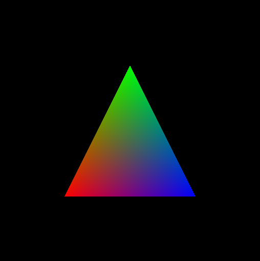

# OpenGL - Atividade 01 (Modern OpenGL Hello World)

> O trabalho é referente a primeira atividade da disciplina de Introdução a Computação Gráfica. O programa deverá apresentar uma janela contendo um triangulo colorido.


[](https://www.opengl.org)


## Objetivos
<ol>
    <li>1. Verificar se o ambiente de desenvolvimento em OpenGL 3.3 está com o funcionamento correto na máquina local;</li>
    <li>2. Exemplificar o funcionamento do OpenGL moderno e do antigo através de exemplos;</li>
</ol>

## Tarefas concluídas
<ol>
    - [x] Verificar se o ambiente de desenvolvimento em OpenGL 3.3 está com o funcionamento correto na máquina local

    - [x] Exemplificar o funcionamento do OpenGL moderno e do antigo através de exemplos
</ol>

## Dificuldades encontradas

Não foram encontradas dificuldade para executar os códigos disponibilizados.

## Pré-requisitos

Caso esteja no Ubuntu, rode os seguintes comandos no terminal para instalar o OpenGl:

```sh
$ sudo apt-get update
$ sudo apt-get install libglu1-mesa-dev freeglut3-dev mesa-common-dev
```

## Utilização

Para executar o código deve-se criar o arquivo compilado para ser executado:

```sh
$ cd modern_opengl/
$ gcc main.c -o [nome executável] -lglut -lGLU -lGL
```

Após isso, basta executar o programa:
```sh
$ ./[nome executável]
```
### Aluno
<ul>
    <li>Matheus Henrique Raposo Dantas – 11414179 – matheusdantas@cc.ci.ufpb.br</li>
</ul>

### Repositório da Atividade

https://github.com/capagot/icg